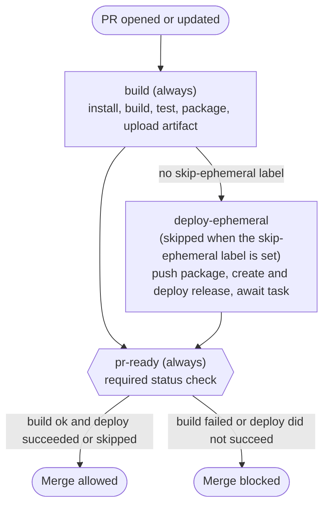

# microsite-deployment

Shared deployment assets for Octopus **microsites** — static sites (devops
portals, blogs, documentation) hosted on Azure Blob Storage. Rather than each
microsite repository carrying its own copy of this plumbing, they consume it
from here, so the build, packaging, and infrastructure logic stays consistent
across every site.

This repository provides three things:

- **Reusable GitHub Actions workflows** that build, test, package, and hand a
  microsite off to Octopus Deploy — including per-pull-request ephemeral
  environments.
- **Terraform** that provisions the Azure static-website infrastructure.
- **A content deployment script** that syncs built site content into the
  storage account's `$web` container.

## Repository structure

```
.github/
  composite/versions/         # Pinned Node + pnpm versions shared by the workflows
  workflows/                  # Reusable build/deploy workflows called by microsite repos
terraform/                    # Azure static-website infrastructure (Terraform)
scripts/                      # PowerShell scripts run by the Octopus deployment process
```

---

## Reusable workflows

The workflows in `.github/workflows/` are [reusable
workflows](https://docs.github.com/actions/using-workflows/reusing-workflows)
(`on: workflow_call`). A microsite repository invokes them from its own
workflow, for example:

```yaml
jobs:
  deploy:
    uses: OctopusDeploy/microsite-deployment/.github/workflows/microsite-deployment-branch.yml@main
    with:
      octopus_project_name: My Microsite
      package_id: My.Microsite
    secrets: inherit
```

Both workflows take the same inputs:

| Input | Purpose |
|---|---|
| `octopus_project_name` | The Octopus project to release/deploy |
| `package_id` | The package ID used for the built site artifact |

Deployment to Octopus is gated by the `SHOULD_DEPLOY` flag, which is derived
from whether the `OCTOPUS_SERVER_URL` secret is present. When it is absent
(for example on a fork without access to the secret), the site is still built
and packaged, and the package is uploaded as a workflow artifact instead of
being pushed to Octopus.

### Shared version pinning

Both workflows resolve their Node and pnpm versions from the composite action
in `.github/composite/versions`, rather than hard-coding them per workflow:

```yaml
- name: Retrieve versions
  uses: OctopusDeploy/microsite-deployment/.github/composite/versions@main
  id: versions

- uses: pnpm/action-setup@v6
  with:
    version: ${{ steps.versions.outputs.pnpm-version }}

- uses: actions/setup-node@v6
  with:
    node-version: ${{ steps.versions.outputs.node-version }}
```

The action exposes `node-version` and `pnpm-version` outputs, giving a single
place to bump the toolchain for every workflow at once.

### Full deployment — `microsite-deployment-full.yml`

Intended for deploying the site proper (e.g. on merge to the main branch). A
single `build_and_deploy` job builds and tests the site, creates the package,
pushes it and its build information to Octopus, and creates a release. It does
not provision an ephemeral environment.

### Pull request deployment — `microsite-deployment-branch.yml`

Builds each pull request and deploys it to a per-PR **ephemeral environment**
in Octopus (`pr<number>`) for review. It is split into three jobs so that
ephemeral provisioning can be made optional without losing the merge-time
safety guarantee:

- **`build`** — always runs. Installs dependencies, builds, tests, creates the
  zip package, and uploads it as an artifact for the deploy job to consume.
- **`deploy-ephemeral`** — runs unless the PR carries the **`skip-ephemeral`**
  label. Contains all Octopus steps: push package and build information, create
  the ephemeral environment, create and deploy a release, and **await the
  deployment task to completion**.
- **`pr-ready`** — a sentinel job that always runs and depends on both. It is
  the job configured as the **required status check** in branch protection.

The await step deliberately lives inside `deploy-ephemeral` (not in
`pr-ready`). Because `pr-ready` cannot complete until `deploy-ephemeral`
finishes, a PR cannot be merged — and its branch deleted — before Octopus has
finished provisioning the environment.

`pr-ready` fails the PR if `build` failed, or if `deploy-ephemeral` ran but did
not succeed. It passes if everything succeeded, or if the ephemeral deployment
was intentionally skipped via the label.



> **Branch protection:** the required status check for this workflow is
> `pr-ready`. If you adopt or rename these jobs, update the required check in
> the consuming repository's branch protection rules to match.

---

## Terraform

### Backend

State is stored in Azure Blob Storage (`terraform/backend.tf`). Authentication
uses OIDC — no access keys or SAS tokens are required. The `#{...}` placeholders
are substituted by Octopus at deploy time.

### Resources provisioned

- **`azurerm_storage_account`** — Standard LRS storage account.
- **`azurerm_storage_account_static_website`** — Enables the `$web` container,
  serving `index.html` as the default document and `404.html` for missing paths.

### Outputs

| Output | Description |
|---|---|
| `static_website_url` | Primary endpoint URL for the static website |

---

## Deployment scripts

The PowerShell scripts in `scripts/` are run as Octopus **Run a Script** steps
at various points in the deployment process:

| Script | Purpose |
|---|---|
| `Deploy-Microsite.ps1` | Syncs the built site package to the storage account's `$web` container using AzCopy with Azure CLI authentication. |
| `Get-StaticSiteUrl.ps1` | Queries Azure for the static website endpoint and exposes it as an Octopus output variable. |
| `Add-PullRequestEnvironmentComment.ps1` | Posts a comment on the pull request with the ephemeral environment URL (used by the PR workflow). |
| `Remove-TerraformState.ps1` | Removes the Terraform state for an environment, e.g. when an ephemeral environment is deprovisioned. |
